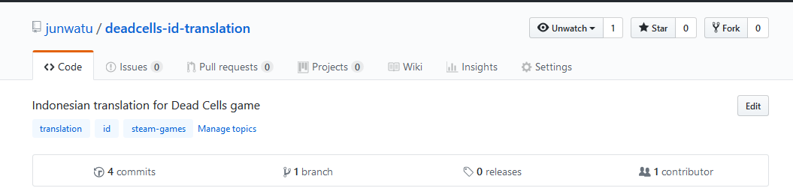
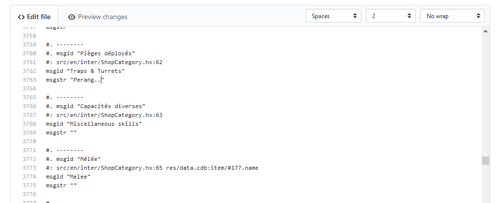

# Dead Cells Indonesian Translation


Repositori *source code* untuk translasi game Dead Cells ke Bahasa Indonesia.

[Steam Workshop](http://steamcommunity.com/sharedfiles/filedetails/?id=1244163580)

## Cara Berkontribusi

Saya sarankan untuk memiliki akun Steam agar bisa di ikut sertakan sebagai kontributor. 

### 1. Fork repositori ini 

Bikin akun di github.com kemudian tekan tombol **fork** di pojok kanan atas.



### 2. Edit file main.po

Bukan file `main.po` dan edit langsung melalui github.com


Translasi dituliskan pada key `msgstr` dengan referensi bahasa yang akan diartikan di key `msgid`



> Untuk kata `::word::` adalah variabel sehingga tidak perlu ditranslasikan

Jangan lupa di simpan.

### 3. Lakukan Pull Request

Tekan tombol **New pull request** jika sudah mengedit kemudian ikuti langkah berikut 

[Github Pull Request from Fork](https://help.github.com/articles/creating-a-pull-request-from-a-fork/) (**Hindari langkah 7!**)


> Untuk memudahkan syncing dengan repo utama setelah Pull Request diterima, hapus saja fork lama di Github kemudian re-fork repo lagi dan lanjutkan lagi proses 2 dan 3.


## Testing Offline

Jika anda ingin melakukan pengetestan secara offline anda perlu menginstal tool untuk meng-kompile berkas `po` karena Dead Cells hanya akan mengambil translasi yang telah dikompilasi seperti `main.mo`. Tool seperti **poedit** bisa anda pakai untuk mengkompilasi file `po`.

> Catatan: Hasil kompilasi akan diabaikan oleh repositori github

Lihat link berikut untuk langkah-langkah pengetestan secara offline http://steamcommunity.com/games/588650/announcements/detail/1253537422578152950

atau ketik aja di *command prompt* dimana game Dead Cells berada, perintah berikut

```
deadcells.exe --workshop-test [direktori_dimana_file_main.mo_setting.json_berada]
```

kemudian pada menu awal pilih setting language `Indonesia`.


